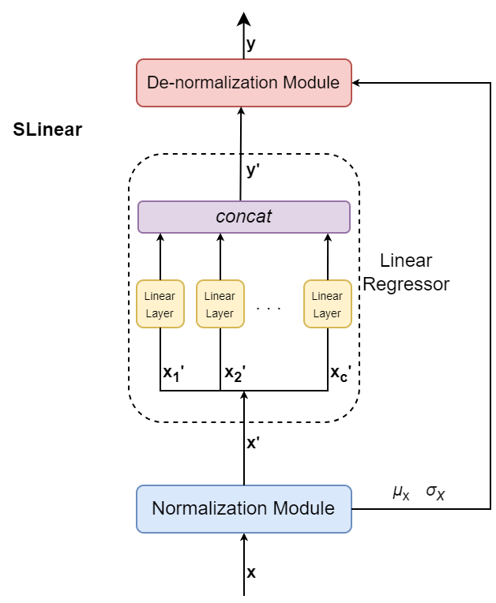
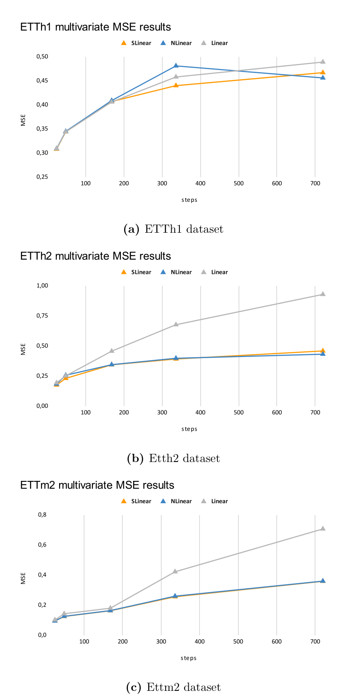

<div align="center">



# SLinear

**Taming the Non-Stationarity in Long Sequence Time Series Forecasting**

A single linear layer, wrapped in learned normalization, beats Transformer-based
forecasters on 5 multivariate benchmarks.

[](https://www.python.org/)
[](https://lightning.ai/)
[](https://wandb.ai/)
[](MS_THESIS_LORENZO_DE_SANTIS_1849114.pdf)

Master's thesis · Sapienza University of Rome · Engineering in Computer Science · 2023

</div>

## TL;DR

- **The problem.** Long Sequence Time Series Forecasting (LSTF) is dominated by ever-larger Transformers, yet real-world series are *non-stationary*: their mean and variance drift, and static normalization (z-score fitted once on the training set) silently degrades every model downstream.
- **The contribution.** **SLinear** — a per-channel linear regressor sandwiched between a sliding-window normalization module and a de-normalization module that restores the original statistics. No attention, no recurrence, one weight matrix per channel.
- **The result.** **−22.5% MSE on ETTh2** and **−23.5% MSE on ETTm2** against the Linear baseline, and a consistent **−0.98% MSE / −0.78% MAE** average against NLinear, the previous best linear model. A second study shows a Transformer encoder (Pyraformer) *hurts* the CoST contrastive framework, while a plain linear encoder beats both.

## Results

### SLinear vs. linear baselines

MSE / MAE in multivariate settings, selected prediction horizons. Lower is better;
**bold** marks the best of the three.

| Dataset | Horizon | SLinear MSE | SLinear MAE | NLinear MSE | NLinear MAE | Linear MSE | Linear MAE |
|---|---|---|---|---|---|---|---|
| ETTh1 | 336 | **0.440** | **0.437** | 0.481 | 0.464 | 0.458 | 0.451 |
| ETTh2 | 168 | **0.344** | 0.395 | 0.345 | **0.389** | 0.457 | 0.454 |
| ETTh2 | 336 | **0.392** | **0.434** | 0.398 | **0.434** | 0.677 | 0.556 |
| ETTm2 | 288 | **0.256** | **0.314** | 0.260 | 0.318 | 0.422 | 0.421 |
| ETTm2 | 672 | **0.359** | **0.379** | 0.360 | 0.380 | 0.707 | 0.546 |
| Electricity | 720 | 0.207 | **0.293** | 0.208 | 0.296 | **0.203** | 0.299 |

<details>
<summary>Average error reduction across all horizons (%, higher is better)</summary>

| Dataset | vs. NLinear MSE | vs. NLinear MAE | vs. Linear MSE | vs. Linear MAE |
|---|---|---|---|---|
| ETTh1 | 1.44 | 1.04 | 1.70 | 1.43 |
| ETTh2 | 1.67 | 0.44 | **22.50** | **11.99** |
| ETTm1 | 0.23 | 0.70 | 0.23 | 0.70 |
| ETTm2 | 0.64 | 0.94 | **23.49** | **16.43** |
| Electricity | 0.59 | 0.71 | −0.76 | 1.14 |
| **Total** | **0.98** | **0.78** | **10.33** | **6.81** |

Full per-horizon tables: Tables 5.1 and 5.2 of the [thesis](MS_THESIS_LORENZO_DE_SANTIS_1849114.pdf).

</details>

<div align="center">
  
</div>

The gap widens with the forecast horizon: on ETTh2 at 720 steps the Linear baseline
reaches 0.929 MSE while SLinear stays at 0.459 — normalization, not capacity, is what
the long horizon was missing.

### Transformers as representation-learning encoders

Swapping the CoST encoder shows the same pattern. A linear encoder (`CoST-Linear`)
beats the original TCN on 4 of 5 benchmarks; Pyraformer collapses on the long
horizons (4.44 MSE on ETTh2/720 vs. 1.98 for the linear encoder).

> [!NOTE]
> Removing CoST's contrastive pre-training entirely (random weights + ridge regressor)
> leaves results essentially unchanged. Most of the framework's performance comes from
> the ridge head, not from the expensive contrastive phase.

## How it works

Three modules, in order:

1. **Normalization (N).** Per sliding window, compute mean `μx` and variance `σx` over the time dimension and standardize the input `x ∈ R^(B×L×C)`. Statistics are computed *per window at inference time*, so the model adapts to distribution shift instead of assuming it away.
2. **Linear Regressor (L).** One independent `L → F` linear layer per channel, outputs concatenated. That is the entire predictive model.
3. **De-normalization (D).** Reapply `μx` and `σx` to the prediction, mapping it back to the original, non-stationary statistics.

Benchmarks: **ETTh1, ETTh2, ETTm1, ETTm2** (Electricity Transformer Temperature) and **Electricity**.

## Repository structure

All experiments ship as self-contained Google Colab notebooks.

| Notebook | Contents | Framework |
|---|---|---|
| [`LSTM_Linear_pipeline.ipynb`](LSTM_Linear_pipeline.ipynb) | **SLinear** and **DaLinear** (ours) + Linear / NLinear baselines | PyTorch Lightning |
| [`CoST_pipeline.ipynb`](CoST_pipeline.ipynb) | Modular CoST: **CoSPy**, **CoST-Linear**, **CoST-NLinear** | PyTorch Lightning |
| [`NLinear_train.ipynb`](NLinear_train.ipynb) | Official LTSF-Linear reference implementation | PyTorch |
| [`CoST_train.ipynb`](CoST_train.ipynb) | Official CoST reference implementation | PyTorch |
| [`train_Pyraformer.ipynb`](train_Pyraformer.ipynb) | Official Pyraformer reference implementation | PyTorch |

## Getting started

> [!IMPORTANT]
> The notebooks ship without credentials. Personal Google Drive paths and the
> Weights & Biases project were stripped before publication, so a fresh clone will
> not run until you fill in the blanks below.

1. **Get the data.** Download the [datasets](https://drive.google.com/drive/folders/1TEf4A4uA_YzQ1G3S3M34sfeixKQN2Jm2?usp=sharing) into your Drive.
2. **Create a [Weights & Biases](https://wandb.ai/) account** — training runs and metrics are logged there.
3. **Recreate the working directory layout** the notebooks expect:

   ```
   .
   ├── best_predictions
   ├── checkpoints
   ├── datasets
   ├── encoding
   ├── forecasting_result
   ├── logs
   ├── models
   ├── test
   └── tools
   ```

4. **Fill in every `TODO` block** — Drive mount point, dataset path and W&B project are marked inline:

   ```python
   ### TODO ###
   #
   #
   ############
   ```

5. **Run the notebook.** Every other hyperparameter (input length, horizon, learning rate, batch size) is exposed at the top and safe to change.

## Citation

```bibtex
@masterthesis{slinear,
    title        = {SLinear: Taming the Non-Stationarity in Long Sequence Time Series Forecasting},
    author       = {Lorenzo De Santis},
    year         = 2023,
    school       = {Sapienza, University of Rome},
    type         = {Master's thesis}
}
```

## References

- Zeng et al., *Are Transformers Effective for Time Series Forecasting?* (LTSF-Linear), AAAI 2023
- Woo et al., *CoST: Contrastive Learning of Disentangled Seasonal-Trend Representations*, ICLR 2022
- Liu et al., *Pyraformer: Low-Complexity Pyramidal Attention for Long-Range Time Series Modeling*, ICLR 2022
- Liu et al., *Non-stationary Transformers: Exploring the Stationarity in Time Series Forecasting*, NeurIPS 2022
